using custume hook
-----------------------------------------------
working with backed
1) npm init
2) npm i express mongoose cors nodemon  dotenv
2) ceate some files and folders (controllers, db, routes,modules,app.js,.env)
----------------------------------------------------------
i) what is npm i express mongoose cors nodemon  dotenv
answer---
---------------
- **`npm i`**: This is shorthand for `npm install`, which installs the listed packages.
- **`express`**: Web framework for building APIs and web servers.
- **`mongoose`**: ODM for connecting and interacting with MongoDB.
- **`cors`**: Enables cross-origin requests in your app.
- **`nodemon`**: Automatically restarts your server when files change during development.
- **`dotenv`**: Loads environment variables from a `.env` file to manage sensitive config data.

4) create a new cluster in monogo and clion on connect with you application and copy the link and paste in the .evn file with mane mongo_url.

5) do code in db.js to connect your mongo to application
6) call the db file by app.js in server 
ex-
        const server = ()=>{
            //console.log("server stated at 5000")
            // to connet the mongodb
            db();
            app.listen(PORT, ()=>{
                console.log("listeing to port:", PORT)
            })

        }

7) create a file in routes name as transactions.js and import the router. and create a simple api uisng get method to display the hello world

8) configure the router in server(app.js) for that do code in app.js
9) we are importing the const{readdirSync} = require('fs') beause that will read a file proprally then it will read blow.

10) readdirSync('./routes').map((route) => app.use('/api/v1', require('./routes/' + route)))
-----------------------explaining--------------------------

### Breakdown of the Code

```javascript
readdirSync('./routes').map((route) => app.use('/api/v1', require('./routes/' + route)))
```

1. **`readdirSync('./routes')`**:
   - This function is part of the `fs` (File System) module in Node.js.
   - `readdirSync` is a synchronous method that reads the contents of a directory. Here, it's reading the contents of the `./routes` directory.
   - It returns an array of file names (including route files) present in the specified directory.

2. **`.map((route) => ... )`**:
   - The `map` method is called on the array of file names returned by `readdirSync`.
   - It iterates over each file name (represented by `route` in the callback function).

3. **`app.use('/api/v1', ...)`**:
   - `app` is an instance of an Express application. 
   - The `use` method is used to mount middleware or route handlers. In this case, it mounts the specified route handler for all routes that start with `/api/v1`.

4. **`require('./routes/' + route)`**:
   - Inside the `map` function, `require` is used to import the route module corresponding to each file in the `./routes` directory.
   - The string concatenation `('./routes/' + route)` creates the correct file path for each route file.
   - The imported module is typically an Express router that defines various route handlers for different HTTP methods (GET, POST, etc.).

### Putting It All Together

In summary, this line of code does the following:
- It synchronously reads all the files in the `./routes` directory.
- For each file, it requires (imports) the route module and mounts it to the Express app under the base URL `/api/v1`.

### Example Scenario

Suppose you have the following files in the `./routes` directory:
- `users.js`
- `products.js`

The code will effectively mount the routes defined in `users.js` and `products.js` to:
- `/api/v1/users`
- `/api/v1/products`

### Conclusion

This approach is often used for modularizing route handling in Express applications, allowing you to organize your routes into separate files for better maintainability and readability. If you have any further questions or need clarification on specific parts, feel free to ask!

-----------------------------------------------------------------------------------------------------------------------------
11) create a file in models called as incomeModel.js
where 

The code you've posted is defining a Mongoose schema for an "Income" model in a Node.js application. Mongoose is an Object Data Modeling (ODM) library for MongoDB and Node.js, which allows you to define schemas and interact with the database easily. Let's break down the code step by step.

// Export the model
module.exports = mongoose.model('Income', IncomeSchema);
```

### Detailed Explanation

1. **Importing Mongoose**:
   ```javascript
   const mongoose = require('mongoose');
   ```
   - This line imports the Mongoose library, which provides functionalities for interacting with MongoDB.

2. **Defining the Schema**:
   ```javascript
   const IncomeSchema = new mongoose.Schema({
       // Fields go here
   }, { timestamps: true });
   ```
   - `new mongoose.Schema(...)` creates a new schema definition.
   - The second argument `{ timestamps: true }` automatically adds `createdAt` and `updatedAt` fields to the schema, allowing you to track when the document was created and last updated.

3. **Schema Fields**:
   - Each field in the schema represents a property of the income document that will be stored in the MongoDB collection. Here’s what each field means:
   
   - **`title`**:
     - Type: `String`
     - Required: `true` (must be provided)
     - `trim`: Removes whitespace from both ends of the string
     - `maxLength`: Limits the string to a maximum of 50 characters

   - **`amount`**:
     - Type: `Number`
     - Required: `true`
     - `trim`: This property is not typically used with `Number`, so it may be redundant.
     - `maxLength`: This is not commonly used with `Number` types; it might be more appropriate for `String`. 

   - **`type`**:
     - Type: `String`
     - Default: `"income"` (if not provided, this value will be set by default)

   - **`date`**:
     - Type: `Date`
     - Required: `true`
     - `trim`: Again, this property is not applicable to `Date` types, so it may be unnecessary.

   - **`category`**:
     - Type: `String`
     - Required: `true`
     - `trim`: Removes whitespace

   - **`description`**:
     - Type: `String`
     - Required: `true`
     - `maxLength`: Limits the string to a maximum of 20 characters
     - `trim`: Removes whitespace

4. **Exporting the Model**:
   ```javascript
   module.exports = mongoose.model('Income', IncomeSchema);
   ```
   - This line exports the model, allowing other parts of your application to import and use it.
   - The model is named `'Income'`, and it uses the `IncomeSchema` schema you defined. Mongoose will automatically create a MongoDB collection named `incomes` (pluralized from the model name).

### Summary

In summary, this code defines a schema for income records, specifying the structure, required fields, and validation rules for documents that will be stored in the `incomes` collection of your MongoDB database. It also sets up automatic timestamps for tracking creation and updates. You can now use this model to create, read, update, and delete income records in your application. If you have further questions or need clarification, feel free to ask!

------------------------------
12) now we are creating a route to create data for tht we will deail with transcation.js which is file of routers folder by creating a api called as 
router.post('/add-income', addIncome) 
here this addIncome method will come from the controller so that we need to ceate a file for thi controller that file is incom.js


explaining 
The code you've provided is a controller function for adding an income entry to a MongoDB database using Mongoose in a Node.js/Express.js application. This function takes the request data (`req.body`), validates it, and then saves the data to the database if everything is correct.

### Breakdown of the Code:

```javascript
const IncomeSchema = require("../models/IncomeModel")
```
- This line imports the Mongoose model `IncomeSchema` from the `IncomeModel` file. This model represents the structure of the income documents in your MongoDB collection.

### Function `addIncome`

```javascript
exports.addIncome = async (req, res) => {
```
- This is an asynchronous function that is being exported. It is designed to handle HTTP requests (likely a POST request) to add an income record. The function receives two parameters:
  - `req`: The request object, which contains data from the client, including the income details in `req.body`.
  - `res`: The response object, used to send a response back to the client.

### Extracting Data from the Request Body

```javascript
const { title, amount, category, description, date } = req.body;
```
- This line uses destructuring to extract the fields `title`, `amount`, `category`, `description`, and `date` from the `req.body`. These fields are expected to be sent by the client in the request.

### Creating a New Income Entry

```javascript
const income = IncomeSchema({
    title,
    amount,
    category,
    description,
    date
});
```
- A new income document is created using the `IncomeSchema` model. The constructor is passed the values for `title`, `amount`, `category`, `description`, and `date` from the request body.

### Validation Logic

```javascript
if (!title || !category || !description || !date) {
    return res.status(400).json({ message: 'All fields are required!' });
}
```
- This condition checks if any of the required fields (`title`, `category`, `description`, or `date`) are missing. If any are missing, the function returns an HTTP 400 response (Bad Request) with a message stating that all fields are required.

```javascript
if (amount <= 0 || !amount === 'number') {
    return res.status(400).json({ message: 'Amount must be a positive number!' });
}
```
- This checks whether the `amount` is a positive number. If the `amount` is less than or equal to 0, or if it's not a valid number, the function returns an HTTP 400 response with a message saying the amount must be a positive number.

### Saving the Income Record to the Database

```javascript
await income.save();
res.status(200).json({ message: 'Income Added' });
```
- If the validation passes, the `income.save()` method is called, which saves the new income document to the MongoDB database.
- If the save is successful, the server responds with an HTTP 200 status (OK) and a message saying "Income Added."

### Error Handling

```javascript
} catch (error) {
    res.status(500).json({ message: 'Server Error' });
}
```
- If any error occurs during the process (e.g., database connection issues), the function catches the error and returns an HTTP 500 response (Internal Server Error) with a message stating "Server Error."

### Logging the Income Object

```javascript
console.log(income);
```
- After the income object is saved, it is logged to the console for debugging purposes. This will print out the income document that was just created, including its unique `_id` that MongoDB automatically generates.

### Summary:

- The function handles a POST request to add a new income record.
- It validates that all required fields (`title`, `category`, `description`, `date`, and `amount`) are provided and that the `amount` is a positive number.
- If validation passes, it saves the income record to the database using Mongoose.
- It responds with a success message if the operation is successful or with an error message if something goes wrong.

This structure is a typical pattern for a REST API in an Express application where the data is validated and stored in a MongoDB database.

-----------------------------------------------------------------------------------------------------------
-----------------------------------------------------------------------------------------------------------
---------------------------------------------------------------------------------------------------------------
--------------------------for front-end-------------------------------------------------------------------------------
1) create a frontend reactproject
2) clear the codes 
3) write the commands as : npm install axios chart.js moment react-chartjs-2 react-datepicker styled-components

explainging of this commnds--------

 Here’s a breakdown of each of the npm packages you are installing with the command `npm install axios chart.js moment react-chartjs-2 react-datepicker styled-components`:

### 1. **axios**
   - **Description**: `axios` is a popular HTTP client for making requests, especially for APIs. It supports promises, which allows asynchronous HTTP requests and handling responses easily.
   - **Common Use Case**: Fetching data from APIs (e.g., `GET`, `POST` requests).
   - **Example**:
     ```js
     import axios from 'axios';

     axios.get('/api/data')
       .then(response => console.log(response.data))
       .catch(error => console.error(error));
     ```

### 2. **chart.js**
   - **Description**: `chart.js` is a versatile library used for creating various types of charts (like bar, line, radar, etc.). 
   - It provides simple configuration options for customization.
   - **Common Use Case**: Visualizing data in charts and graphs in web applications.
   - **Example**:
     ```js
     const data = {
       labels: ['January', 'February', 'March'],
       datasets: [ 
         {
           label: 'Sales',
           data: [30, 50, 40],
           backgroundColor: 'rgba(75, 192, 192, 0.2)',
         },
       ],
     };
     ```

### 3. **moment**
   - **Description**: `moment` is a date manipulation library. It simplifies working with dates and times, including parsing, formatting, and validating.
   - **Common Use Case**: Displaying, formatting, or calculating time and dates in various formats.
   - **Example**:
     ```js
     import moment from 'moment';

     const now = moment().format('MMMM Do YYYY, h:mm:ss a');
     console.log(now); // Outputs: September 27th 2024, 2:45 pm
     ```

### 4. **react-chartjs-2**
   - **Description**: `react-chartjs-2` is a React wrapper for `chart.js`, making it easier to integrate charts into React components.
   - **Common Use Case**: Building reusable chart components in a React application.
   - **Example**:
     ```js
     import { Line } from 'react-chartjs-2';

     const MyChart = () => {
       const data = { /* chart data */ };
       return <Line data={data} />;
     };
     ```

### 5. **react-datepicker**
   - **Description**: `react-datepicker` is a lightweight date picker component for React applications. It provides a user-friendly calendar for selecting dates.
   - **Common Use Case**: Implementing a date picker field for forms.
   - **Example**:
     ```js
     import DatePicker from 'react-datepicker';
     import 'react-datepicker/dist/react-datepicker.css';
     
     const MyComponent = () => {
       const [selectedDate, setSelectedDate] = useState(null);
       return <DatePicker selected={selectedDate} onChange={date => setSelectedDate(date)} />;
     };
     ```

### 6. **styled-components**
   - **Description**: `styled-components` is a popular CSS-in-JS library for styling React components. It allows you to write actual CSS code within your JavaScript and bind styles directly to components.
   - **Common Use Case**: Creating dynamic, reusable styles for React components.
   - **Example**:
     ```js
     import styled from 'styled-components';

     const Button = styled.button`
       background: blue;
       color: white;
       padding: 10px 20px;
     `;
     ```

By using these packages, you can easily build a React-based app with charts, date pickers, styled components, and seamless HTTP requests.


-------------------------
4) create folder components,utils, context, styles
5) create Global 
6) use the google fonts to style the font style. and paste those syle in public/index.html.
   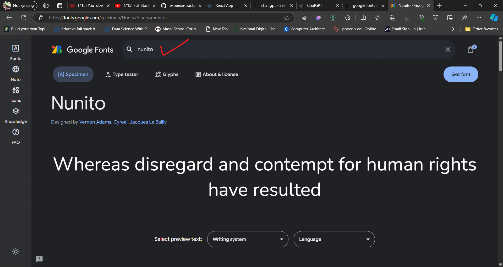
   
7) we are creating the left side componet that is sidebar.

---------------------------------------------
8) to create the right side compoents
9) 
to diplay the data in right side
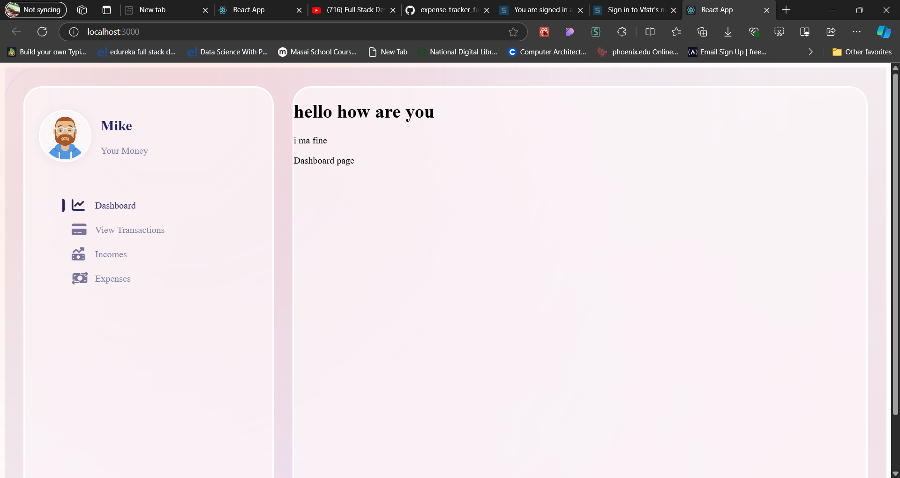
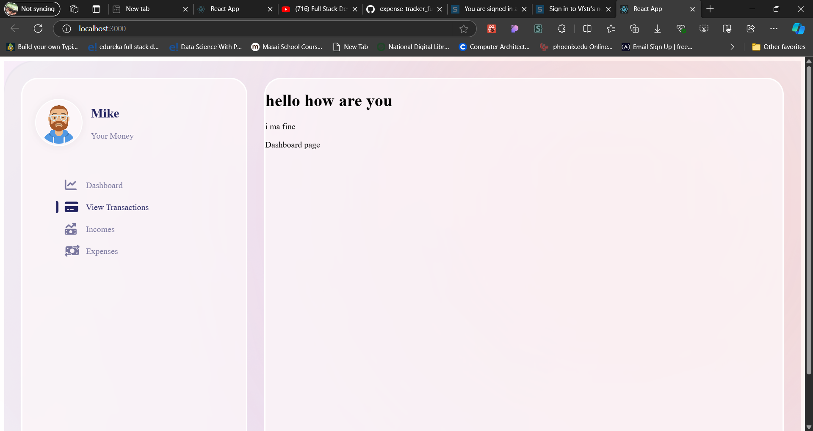
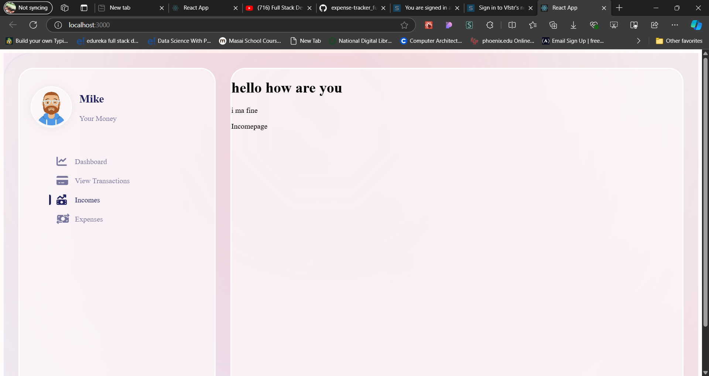
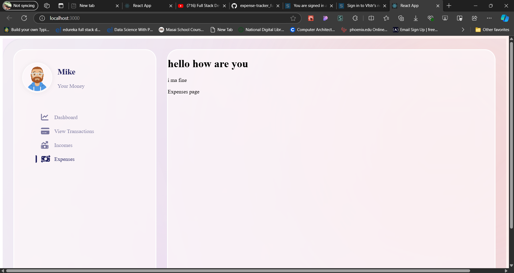

-------------------------------------
----working with income--------
write the code for income here for income to acces it as globlally we are creating a file called as globalContext.js inside he context folder.


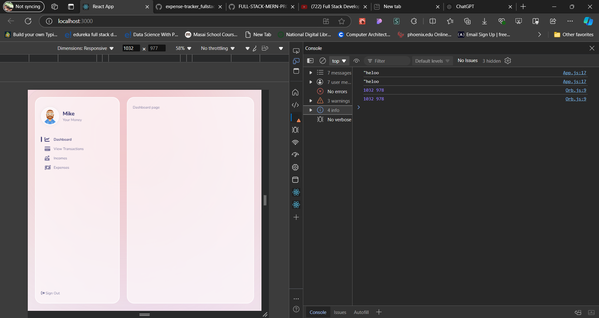


--------------
adding the form folder to create a form file which stored the icome value 
1) to apply the date we are importing the import DatePicker from 'react-datepicker'
   in the Form.js

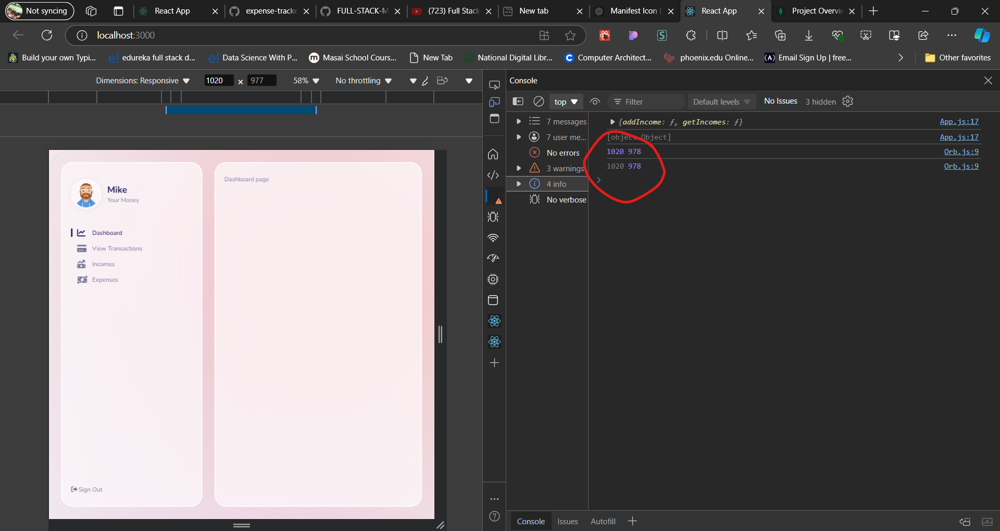
here we are just addding the income details using the income.js and form etc. and below are the screen short details.
but before that you must have to run the backend and front end both application should be run ok otherwise it will give the error.

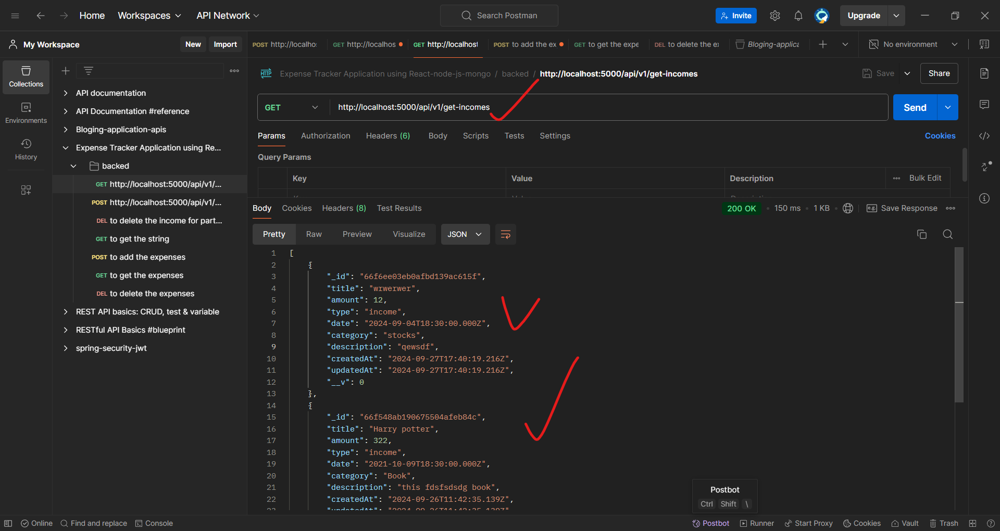
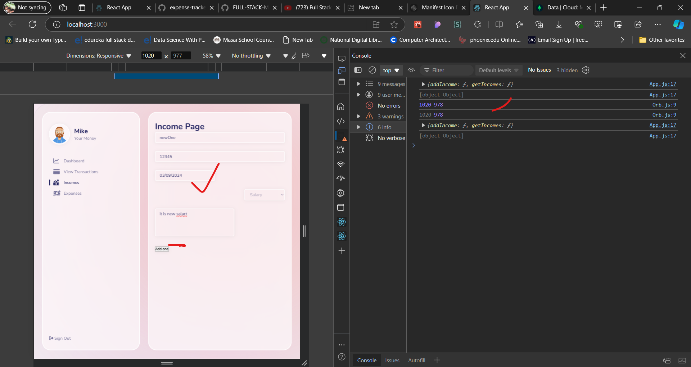

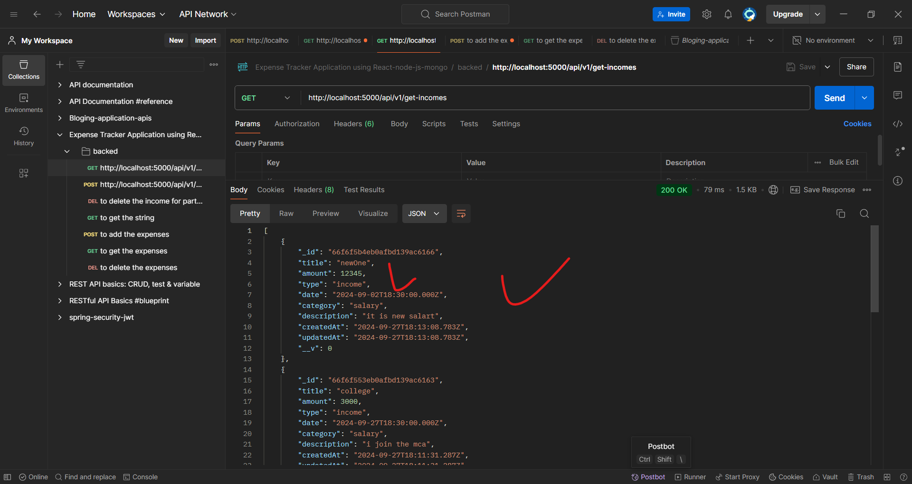
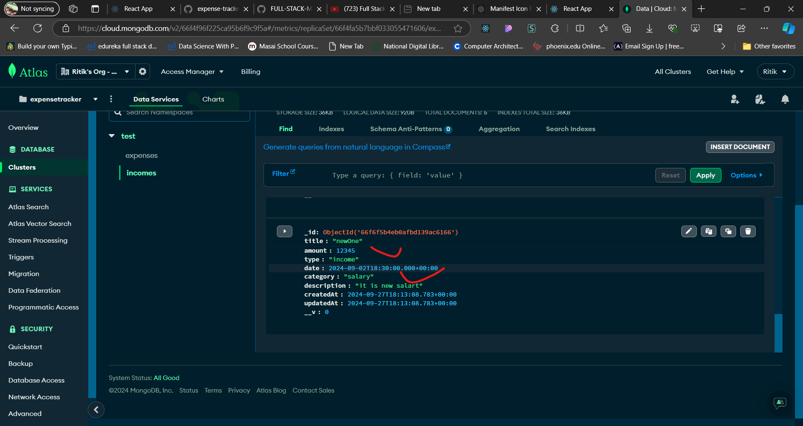

----------------
to design the form button we are creating a button file and design it

------------------------------------------------------------------------------------------------------------
------------------------------to display the income------------------------------------------------

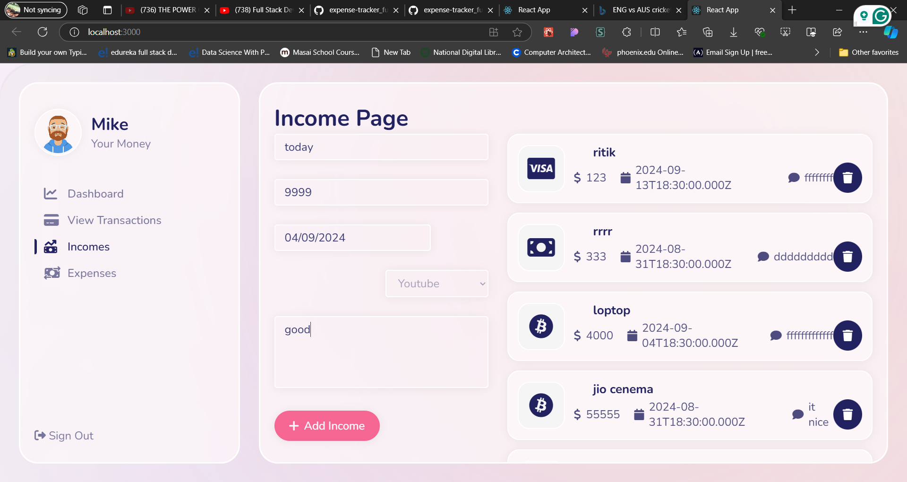
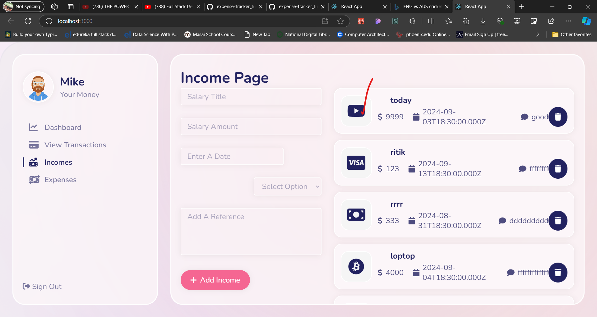


---------------------------------------------------------------------------------------------------------
-------------------------------to delete the incomes----------------------------------------

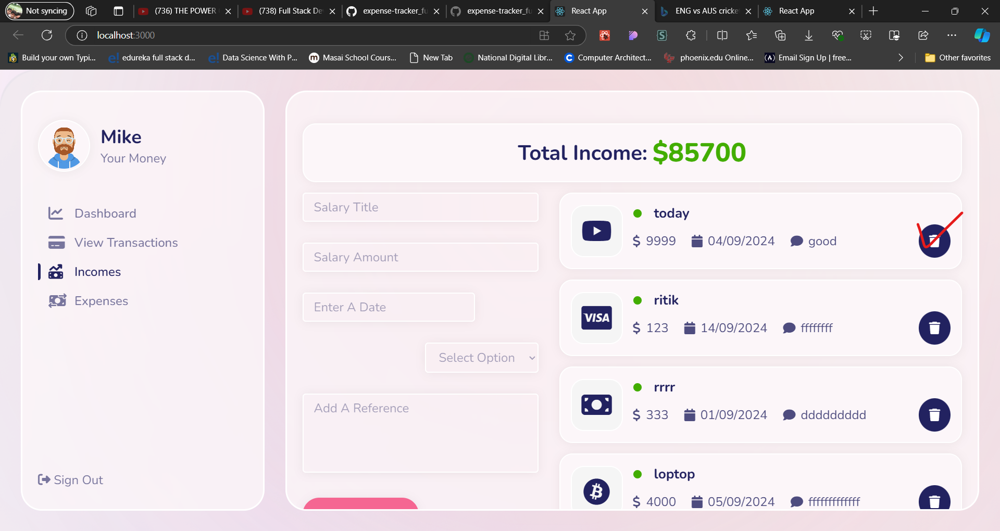
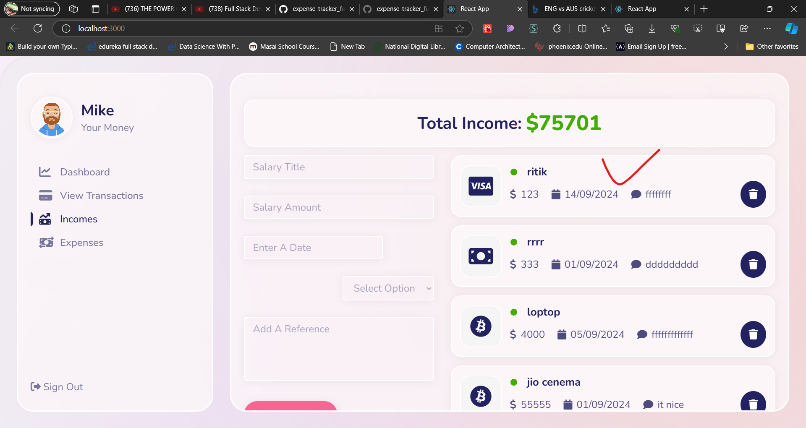
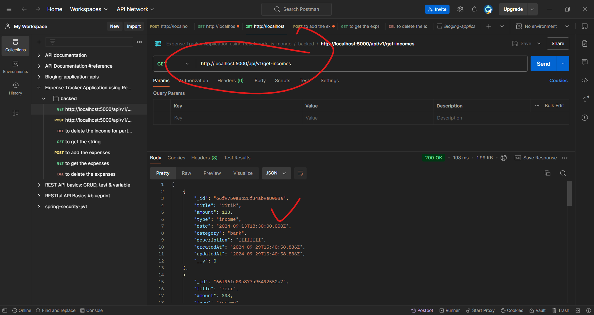

-----------------------------------------------------------------------------------------------------------
----------------------------------globalContext.js details-----------------------------------------
now the income and expensive both are almost same so we arerr copy the  code of income and paste it in Exprensive and change based on requred.